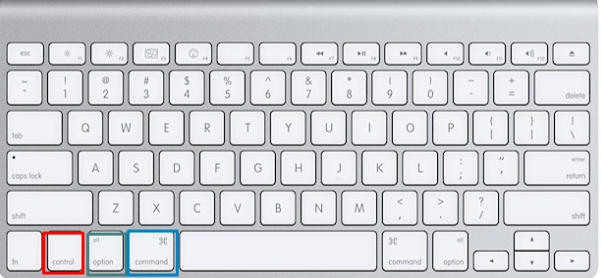

English Version: [README.md](README.md)
中文版: [README.zh.md](README.zh.md)
Jian Ti Zhong Wen Ban: [README.jt.md](README.jt.md)
Francias Version: [README.fr.md](README.fr.md)

The objective of this comprehensive standard operating procedure (SOP) is to provide in-depth guidance and training to Starlight tech team members on the effective utilization of multimedia processing tools, including Canva, VLC, and QuickTime. This SOP is specifically designed to equip new members of the Starlight tech team with the necessary knowledge and skills to proficiently organize, create, and process multimedia assets for Starlight's online platforms. By following this SOP, team members will gain a solid foundation in multimedia processing, enabling them to enhance the quality and impact of Starlight's online presence.

## Table of Contents
- [Appendix](#appendix-1---using-apple-ecosystem)
    - [Appendix 1 - Using Apple Ecosystem](#appendix-1---using-apple-ecosystem)
    - [Appendix 1.1 - Taking a Screenshot](#appendix-11---taking-a-screenshot)
    - [Appendix 1.2 - Spotlight](#appendix-12---spotlight)
- [Processing LiveStream Videos Recordings](#processing-livestream-videos-recordings)
    - [Merging in QuickTime](#merging-in-quicktime)
    - [Trimming in QuickTime](#trimming-in-quicktime)
    - [Fixing Mono Audio in VLC](#fixing-mono-audio-in-vlc)
- [Thumbnail Creation](#thumbnail-creation)
- [Uploading to YouTube](#uploading-to-youtube)
- [Advanced Thumbnail Creation](#advanced-thumbnail-creation)


### Appendix 1 - Using Apple Ecosystem

The computer hardware and peripherals utilized by Starlight are based on the MacOS ecosystem. Notably, there are significant distinctions between MacOS and Windows, including the layout of the MacOS keyboard. The MacOS keyboard incorporates the control (red), option (green), and command (blue) keys. The command key functions similarly to the Ctrl key in Windows, for example, Command + C is equivalent to Ctrl + C which is the shortcut for copy; while the option key serves as the equivalent of Alt. It is important to acknowledge that the behavior of MacOS programs may diverge from their Windows counterparts due to their distinct design principles.



### Appendix 1.1 - Taking a Screenshot

To take a screenshot, press Command + 3. It will save the screenshot in your desktop folder, which is located at ~/Desktop or the full name of /User/Starlight/Desktop.

### Appendix 1.2 - Spotlight
Spotlight is a powerful search tool available on MacOS that enables users to quickly locate files, folders, and applications. To access Spotlight, simply press the Command + Space key combination. This convenient feature is particularly useful for troubleshooting audio issues by accessing the Audio settings. 

### Administrative Limitation

Due to strict administrative limitations, Starlight tech team members are prohibited from installing any additional applications on Starlight computers. However, despite this significant constraint, we have access to a set of essential tools that are already installed on the computers, including VLC, QuickTime, Google Chrome, and ProPresenter. These tools provide a basic foundation to overcome the administrative limitations and carry out multimedia processing tasks effectively.

## Processing LiveStream Videos Recordings

Starlight livestream records the entire livestream session and saves it as a video file. However, we only need to upload the main portion of the livestream to YouTube. Therefore, it is necessary to trim the video file. Additionally, there may be instances where recording problems result in multiple files, requiring them to be merged together. In some cases, the audio may also have issues that need to be addressed using VLC. This section provides instructions on how to use QuickTime and VLC to trim, merge, and fix audio problems.

### Merging in QuickTime

In the case where we have recording problems and we have multiple video files, we need to merge them together. To merge them together, open QuickTime and click Edit > Add clips to end.Then, select all the video files you want to merge. After you are done, click File > Export As and give a name to the video.

`There are no images yet, I will update the image instruction once I have access to church Mac.`

### Trimming in QuickTime

To trim a video in QuickTime, open the video file in QuickTime. Preview the video and take note of the timestamp, you can note down the timestamp in the Apple default Notes app. Use Command + Enter to search for Notes app. Then, click Edit > Trim. You can drag the yellow bar to trim the video. After you are done, click Trim. Then, click File > Export and give a name to the video. 

`There are no images yet, I will update the image instruction once I have access to church Mac.`

### Fixing Mono Audio in VLC

Sometimes the audio may come out from one channel only and it is not suitable for YouTube. It is best to avoid this problem by checking the audio configuration before the livestream. However, if the audio problem is unavoidable, we can fix it in VLC. To fix the audio, open VLC and click File > Convert/Save. Here I will demonstrate with a file that has the right audio channel removed on purpose. 


In VLC, click Add and select the video file. Then go to Media > Convert/Save. Now click the plus icon to add your media. Then click Convert/Save.


In the next window, select the profile H.264 + MP3 (MP4) and click the wrench icon. For encapsulation, select MP4/MOV. For video codec, select the checkbox for "use original video track". For audio codec, change the codec to MPEG Audio (AAC), under Channels, change the number of channels to 1. Then click Save.


Now you'll need to select a destination file. Then click Start. The file will be converted and saved to the destination file.


If everything is configured correctly, the audio will be fixed and the sound will come out from both channels.


```diff
- Warning: If you are using a Mac and selecting "use original video track" does not work, you can try to select "Video - H.264 + MP3 (MP4)" for video codec, I have not tested the reliability/reproducibility of "use original video track" since I do not have access to church's Mac. It is preferred to use "use original video track" since it is faster. If I have access to church's Mac, I will test for consistent results and update this SOP.
```

## Thumbnail Creation

We use an online tool called Canva to create thumbnails for our YouTube videos. To create a thumbnail, go to [Canva](https://www.canva.com/). We have several templates for thumbnails, all in a project named "Starlight Ministries".


The image below shows many styles I have created for thumbnails. The goal is to change a style every month to keep the thumbnails fresh while keeping the style consistent. The complexity thumbnail creation is low so you can edit the thumbnails directly from the template, no need to duplicate. We will demonstrate using the second template.


The editable field are highlighted in red. To edit the text, double click the text and make the nessecary changes. In this case, the highlighted are 

`DATE - 主日敬拜`

`Sermon Title/Sermon Verse (if applicable)`

`Speaker`

These are the bare minimum information we need to include in the thumbnail. There are more advanced customization I will show in the next example.

## Uploading to YouTube

To upload a video, you'll need to make sure both the video and thumbnail are ready. It is recommended to have the video ready first, start the upload, and then create the thumbnail since the upload can take a long time. To upload a video, go to YouTube and click upload, select your file.


This is the YouTube upload window. I have already setup the default title template, you just have to edit the date, sermon title, and speaker. To upload the thumbnail, click on the thumbnail and select the thumbnail file. Our description template is from an email sent from the default starlight email address. You can copy and paste the description from the email. Now proceed to Visibility tab, make sure the visibility is set to public then click publish.


## Advanced Thumbnail Creation


In this template, the bare minimum information is included, but adding images can greatly enhance the quality and attractiveness of the thumbnail. Images can help visually represent the content of the video, catch the viewer's attention, and make the thumbnail more engaging. To add images, you can use the powerful built-in Canva image search. 

 

In the sidebar, click on Elements and begin the search. Canva will return results grouped by Graphics or Photos, you can also filter by color. Alternative you can upload your own by drag and drop. Images should be consistent with the color scheme of the template and the topic of the sermon.


Here is an example that violates the color scheme and the topic of the sermon. The image consists of pink and red and about devils, which is not consistent with the blue theme and the topic of the sermon.


In this template, I have added a cutout image of the speaker. This is done using the built-in Canva background remover. To use the background remover, click on the image > Edit Photo > BG Remover. Canva will automatically process the image. To can choose an image by going through the sermon recording and screenshot a good image. Refer to [Appendix 1.1 - Taking a Screenshot](#appendix-11---taking-a-screenshot) for instructions on how to take a screenshot.


