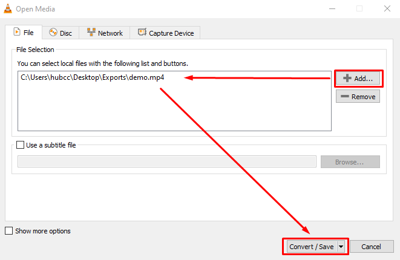

[README.md](README.md) |
中文版: [README.zh-CN.md](README.zh-CN.md) |
繁體版: [README.zh-TW.md](README.zh-TW.md) | 
Francais Version: [README.fr.md](README.fr.md)

这份综合标准操作规程（SOP）的目标是为Starlight技术团队成员提供深入的指导和培训，以有效利用多媒体处理工具，包括Canva、VLC和QuickTime。这份SOP专门为Starlight技术团队的新成员提供必要的知识和技能，以熟练地组织、创建和处理Starlight在线平台的多媒体资产。通过遵循这份SOP，团队成员将建立起多媒体处理的坚实基础，从而提升Starlight在线存在的质量和影响力。

## 目录
- [附录](#附录-1---使用苹果生态系统)
    - [附录1 - 使用苹果生态系统](#附录1---使用苹果生态系统)
    - [附录1.1 - 截屏](#附录11---截屏)
    - [附录1.2 - Spotlight](#附录12---spotlight)
- [处理直播视频录制](#处理直播视频录制)
    - [在QuickTime中合并](#在quicktime中合并)
    - [在QuickTime中修剪](#在quicktime中修剪)
    - [在VLC中修复单声道音频](#在vlc中修复单声道音频)
- [缩略图创建](#缩略图创建)
- [上传到YouTube](#上传到youtube)
- [高级缩略图创建](#高级缩略图创建)

### 附录1 - 使用苹果生态系统

Starlight使用的计算机硬件和外围设备基于MacOS生态系统。值得注意的是，MacOS和Windows之间存在重大差异，包括MacOS键盘的布局。MacOS键盘包括控制（红色）、选项（绿色）和命令（蓝色）键。命令键的功能类似于Windows中的Ctrl键，例如，Command + C等同于Ctrl + C，Ctrl + C是复制的快捷键；而选项键则相当于Alt键。需要注意的是，由于其独特的设计原则，MacOS程序的行为可能与Windows的对应程序有所不同。

### 附录1.1 - 截屏

要截取屏幕截图，请按Command + 3。它将把屏幕截图保存在桌面文件夹中，位于~/Desktop或完整路径/User/Starlight/Desktop。

### 附录1.2 - Spotlight
Spotlight是MacOS上的一个强大的搜索工具，可以快速定位文件、文件夹和应用程序。要访问Spotlight，只需按下Command + Space组合键。这个方便的功能对于通过访问音频设置来解决音频问题非常有用。

### 管理限制

由于严格的管理限制，Starlight技术团队成员被禁止在Starlight计算机上安装任何额外的应用程序。然而，尽管存在这个重大限制，我们可以访问一组已经安装在计算机上的基本工具，包括VLC、QuickTime、Google Chrome和ProPresenter。这些工具为克服管理限制和有效地执行多媒体处理任务提供了基本的基础。

## 处理直播视频录制

Starlight直播记录了整个直播会话并将其保存为视频文件。然而，我们只需要将直播的主要部分上传到YouTube。因此，有必要修剪视频文件。此外，有时会出现录制问题导致多个文件，需要将它们合并在一起。在某些情况下，音频可能也存在问题，需要使用VLC进行处理。本节介绍如何使用QuickTime和VLC修剪、合并和修复音频问题的方法。

### 在QuickTime中合并

如果我们遇到录制问题并有多个视频文件，我们需要将它们合并在一起。要将它们合并在一起，打开QuickTime并点击编辑 > 添加剪辑到末尾。然后，选择要合并的所有视频文件。完成后，点击文件 > 另存为，并给视频命名。

`目前还没有图片，一旦我可以访问教堂的Mac，我会更新图片说明。`

### 在QuickTime中修剪

要在QuickTime中修剪视频，打开QuickTime中的视频文件。预览视频并记录时间戳，可以将时间戳记在Apple默认的Notes应用中。使用Command + Enter搜索Notes应用。然后，点击编辑 > 修剪。您可以拖动黄色条来修剪视频。完成后，点击修剪。然后，点击文件 > 导出，并给视频命名。

`目前还没有图片，一旦我可以访问教堂的Mac，我会更新图片说明。`

### 在VLC中修复单声道音频

有时音频只能从一个声道输出，这对于YouTube来说是不合适的。最好在直播之前检查音频配置，以避免此问题。然而，如果音频问题无法避免，我们可以在VLC中修复它。要修复音频，打开VLC并点击文件 > 转换/保存。这里我将演示一个故意删除右声道的文件。

在VLC中，点击添加并选择视频文件。然后转到媒体 > 转换/保存。现在点击加号图标添加您的媒体。然后点击转换/保存。

在下一个窗口中，选择配置文件H.264 + MP3（MP4）并点击扳手图标。对于封装，选择MP4/MOV。对于视频编解码器，选择“使用原始视频轨道”的复选框。对于音