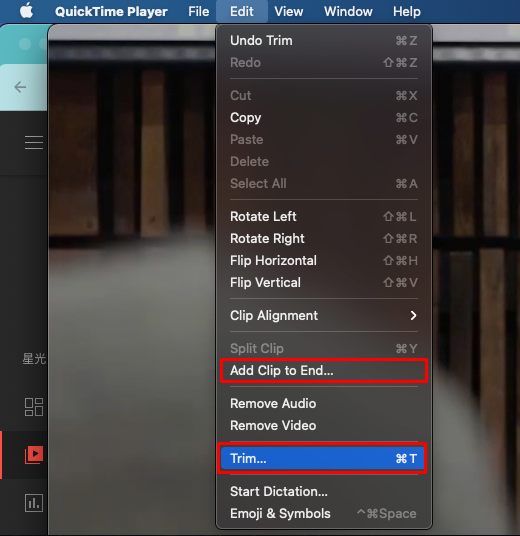
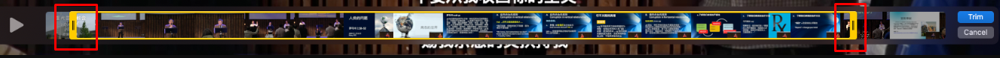
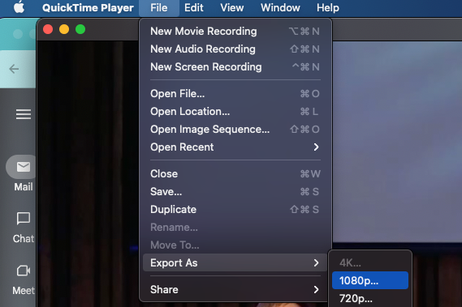
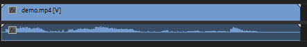

```markdown
中文版: [README.zh-CN.md](README.zh-CN.md) |
繁體版: [README.zh-TW.md](README.zh-TW.md) | 
Francais Version: [README.French.md](README.French.md)

这份全面的标准操作规程（SOP）的目标是为Starlight技术团队成员提供深入的指导和培训，以有效利用多媒体处理工具，包括Canva、VLC和QuickTime。该SOP专门设计为装备Starlight技术团队的新成员，使他们具备组织、创建和处理Starlight在线平台多媒体资产所需的知识和技能。通过遵循这份SOP，团队成员将在多媒体处理方面建立坚实的基础，从而能够提升Starlight在线存在的质量和影响力。

## 目录
- [附录](#附录-1---使用苹果生态系统)
    - [附录 1 - 使用苹果生态系统](#附录-1---使用苹果生态系统)
    - [附录 1.1 - 截屏](#附录-11---截屏)
    - [附录 1.2 - Spotlight](#附录-12---spotlight)
- [处理直播视频录制](#处理直播视频录制)
    - [在QuickTime中合并](#在quicktime中合并)
    - [在QuickTime中修剪](#在quicktime中修剪)
    - [在VLC中修复单声道音频](#在vlc中修复单声道音频)
- [缩略图创建](#缩略图创建)
- [上传到YouTube](#上传到youtube)
- [高级缩略图创建](#高级缩略图创建)


### 附录 1 - 使用苹果生态系统

Starlight使用的计算机硬件和外围设备基于MacOS生态系统。值得注意的是，MacOS和Windows之间存在重大区别，包括MacOS键盘的布局。MacOS键盘包括控制（红色）、选项（绿色）和命令（蓝色）键。命令键的功能类似于Windows中的Ctrl键，例如，Command + C相当于Ctrl + C，即复制的快捷键；而选项键则相当于Alt。重要的是要认识到，由于其独特的设计原则，MacOS程序的行为可能与Windows对应物有所不同。


### 附录 1.1 - 截屏

要截屏，请按Command + Shift + 3。它将保存截图到桌面文件夹，位于〜/Desktop或/User/Starlight/Desktop的完整路径。

### 附录 1.2 - Spotlight
Spotlight是MacOS上的强大搜索工具，可让用户快速定位文件、文件夹和应用程序。要访问Spotlight，只需按Command + Space键组合。这个方便的功能对于通过访问音频设置来解决问题的故障排除非常有用。

### 行政限制

由于严格的行政限制，Starlight技术团队成员被禁止在Starlight计算机上安装任何额外的应用程序。然而，尽管存在这一重大限制，我们可以访问一组已经安装在计算机上的基本工具，包括VLC、QuickTime、Google Chrome和ProPresenter。这些工具为克服行政限制并有效进行多媒体处理任务提供了基本的基础。

## 处理直播视频录制

Starlight直播记录整个直播会话并将其保存为视频文件。然而，我们只需要将直播的主要部分上传到YouTube。因此，有必要修剪视频文件。此外，可能会出现由于录制问题导致多个文件的情况，需要将它们合并在一起。在某些情况下，音频也可能存在问题，需要使用VLC进行处理。本节提供了使用QuickTime和VLC进行修剪、合并和修复音频问题的说明。

### 在QuickTime中合并

在我们遇到录制问题并有多个视频文件的情况下，我们需要将它们合并在一起。要将它们合并在一起，请打开QuickTime，然后单击编辑 > 添加剪辑到末尾。然后选择要合并的所有视频文件。完成后，单击文件 > 导出为，为视频命名。



### 在QuickTime中修剪

要在QuickTime中修剪视频，请在QuickTime中打开视频文件。预览视频并记录时间戳，可以在Apple默认的Notes应用中记录时间戳。使用Command + Enter搜索Notes应用。然后，单击编辑 > 修剪。您可以拖动黄色条来修剪视频。完成后，单击修剪。然后，单击文件 > 导出为 > 1080p，并为视频命名。





### 在VLC中修复单声道音频

有时音频可能只从一个声道输出，不适合YouTube。最好通过在直播前检查音频配置来避免这个问题。然而，如果音频问题无法避免，我们可以在VLC中修复它。要修复音频，请打开VLC，然后单击文件 > 转换/保存。在这里，我将演示有意删除了右音频通道的文件。



